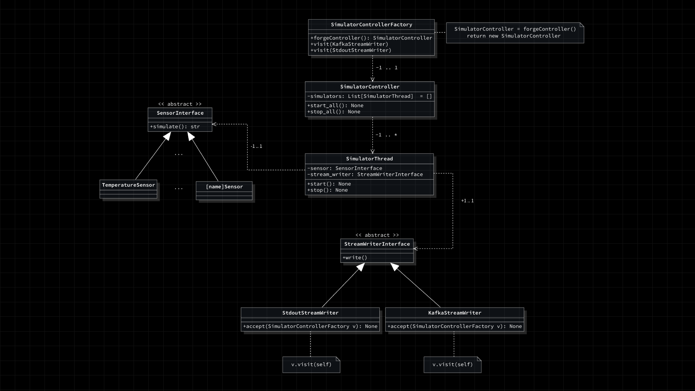

*Nota: Il diagramma sopra rappresentato è un'astrazione e una generalizzazione del generatore di dati `PyMockSensors`. Non tutte le classi considerate "utility" o tutti i parametri e attributi non essenziali per la comprensione della struttura dell'algoritmo sono mostrati. Per ulteriori dettagli sulla struttura completa del progetto `SyncCity`, si prega di consultare la [repository della documentazione](https://github.com/NaN1fy/docs).*

## Schema Semplificato del Funzionamento di PyMockSensors

Il progetto `PyMockSensors` è stato sviluppato adottando un approccio orientato agli oggetti (OOP), utilizzando i pattern `factory method` e `visitor`.

### Factory Method e Visitor Pattern

Vista l'impossibilità di definire direttamente nel codice ciascuna istanza dei sensori, è stata introdotta una factory che, utilizzando un formato dati strutturato, semplifica l'istanziamento degli stessi.

La classe `SimulatorControllerFactory` (cfr. [**simualtor_controller_factory.py**](https://github.com/NaN1fy/SyncCity/blob/main/PyMockSensors/src/sim_toolkit/simulator_controller_factory.py)) ha il compito principale di istanziare un sensore per ogni entry del file `assets/config.json` e di associar loro un controller che li gestisca.

### Controller e Wrapper

Il controller è rappresentato dalla classe `SimulatorController` (cfr. [**simulator_controller.py**](https://github.com/NaN1fy/SyncCity/blob/main/PyMockSensors/src/sim_toolkit/simulator_controller.py)). Quest'ultimo non utilizza direttamente i sensori ma una classe "wrapper" che eredita da `Thread` (cfr. [**riga 8**](https://github.com/NaN1fy/SyncCity/blob/main/PyMockSensors/src/sim_toolkit/simulator_thread.py#L8) in **simulator_thread.py**) al fine di consentire un'esecuzione concorrente.

La classe "wrapper" `SimulatorThread` esegue ciclicamente (a meno di eventi di stop) il metodo astratto `simulate()` (cfr. [**riga 27**](https://github.com/NaN1fy/SyncCity/blob/main/PyMockSensors/src/sensor/sensor_interface.py#L27) in **sensor_interface.py**) del sensore, che restituisce la simulazione del dato in formato JSON.

### Separazione tra Modello, Controllo e Vista

Seguendo il pattern Model-View-Control, la rappresentazione del dato simulato è mantenuta separata dall'implementazione e dalla gestione. A tal fine è stata definita una classe `StreamWriterInterface` che si occupa della consegna dell'informazione (cfr. [**stdout_stream_writer.py**](https://github.com/NaN1fy/SyncCity/blob/main/PyMockSensors/src/stream_writer/stdout_stream_writer.py) e [**kafka_stream_writer.py**](https://github.com/NaN1fy/SyncCity/blob/main/PyMockSensors/src/stream_writer/kafka_stream_writer.py)).

### Implementazione dei Sensori

L'implementazione dei sensori avviene attraverso un'interfaccia comune, `SensorInterface`, dalla quale derivano classi specifiche per ogni tipologia di sensore. Ogni sensore presenta un metodo `accept()` (cfr. [**riga 5**](https://github.com/NaN1fy/SyncCity/blob/main/PyMockSensors/src/stream_writer/stream_writer_interface.py#L5) in **stream_writer_interface.py**) che funge da discriminante per la factory, che agisce in modo diverso a seconda della sorgente di output selezionata.
